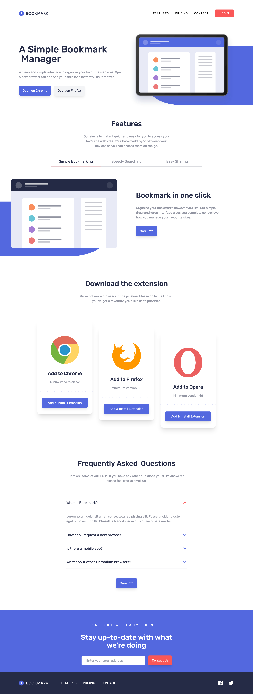

# Frontend Mentor - Bookmark landing page solution

This is a solution to the [Bookmark landing page challenge on Frontend Mentor](https://www.frontendmentor.io/challenges/bookmark-landing-page-5d0b588a9edda32581d29158). Frontend Mentor challenges help you improve your coding skills by building realistic projects.

## Table of contents

- [Overview](#overview)
  - [The challenge](#the-challenge)
  - [Screenshot](#screenshot)
  - [Links](#links)
- [My process](#my-process)
  - [Built with](#built-with)
- [Author](#author)

## Overview

### The challenge

Users should be able to:

- View the optimal layout for the site depending on their device's screen size
- See hover states for all interactive elements on the page
- Receive an error message when the newsletter form is submitted if:
  - The input field is empty
  - The email address is not formatted correctly

### Screenshot

### Links

- Solution URL: [github repo](https://github.com/Nabster2010/bookmark-landing-page)
- Live Site URL: [live site](https://elaborate-peony-4cd6b1.netlify.app/)

### Built with

- Semantic HTML5 markup
- Flexbox
- reactjs
- Mobile-first workflow
- tailwindcss

## Author

- Frontend Mentor - [@Nabster2010](https://www.frontendmentor.io/profile/Nabster2010)
- Twitter - [@yMahmoudElGarhey](https://www.twitter.com/MahmoudElGarhey)
